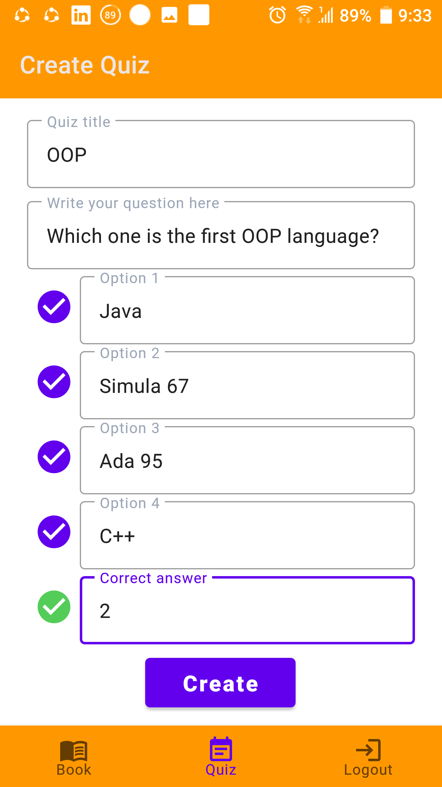
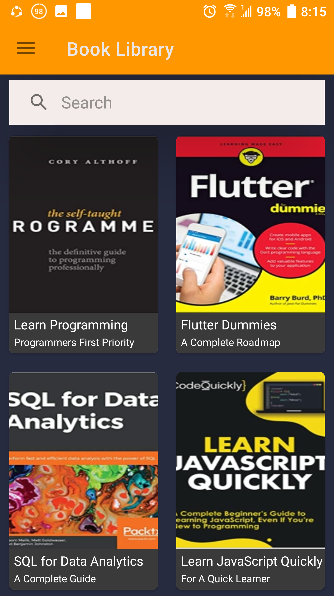

# EduOrigin
1.EduOrigin is an android app that is based on online learning.  
2.It has various features like book reading and an online quiz system for learning purposes.  
3.Besides, It has a to-do list feature that helps a student to set his/her goal.  
4.The project is built in Android Studio using Java. The Retrofit library is used for API integration. Besides, PHP and MySQL are used in the Backend for API development and Database.

# Project Description

My-Day is an **android app** about setting goals and task scheduling and current world news system. Here, a user can set his goals by adding list of to-do tasks.
He/she can update his regular task list and delete if needed. He/She can also search his regular task through keywords.
Besides, all the tasks are added and updated instantly in RecyclerView with recent data and time using LiveData and Kotlin coroutines.
A user can see the current world news data which is feching through API call. At last, he/she can read several types of online news paper through Web View.
The project is built with Kotlin following the MVVM architecture. Besides, the Room database is used for storing user data and volley library is used in API call.

## Features:
1. User Login and Registration System
2. User Authentication and Session Management System
3. Online Book Library and Book Reading System
4. Online MCQ with Scoring System
5. Particular Book Searching System Through Keywords
6. Admin Panel for Creating Quizes and Uploading Books
7. Learning from Many Online Resources through Web View
8. Realtime Book and Quiz Updating System

### Languages: 
Java,PHP
### Databases:
MySQL
### Tools and Technologies: 
Android Studio

## Project Demo:

### Splash Screen:
 

### Current World News System
      

### Task Scheduling System
   

### Task Adding System
 

### Task Updating System
 

### Particular Task Searching System
 

### Online News Reading System

  

## Topics:
1. Animated Splash Screen    
2. RecyclerView    
3. CardView    
4. Adapter    
5. Material UI Design   
6. Dexter     
7. PDF Viewer   
8. Live Data    
9. MySQL Database       
11. Retrofit    
12. Glide    
13. WebView    
14. API CALL  
15. API Development and Integration  
16. Material Components
17. User Registration and Authentication
18. User Session Management
19. Admin Session Management

